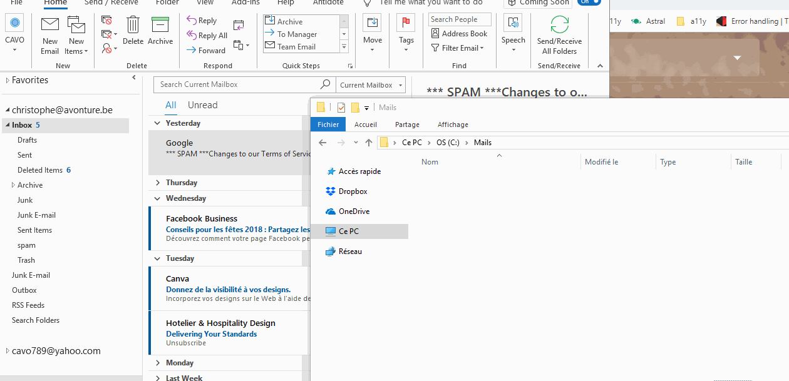

# Enhanced Guide: Saving Selected Emails as PDFs in Outlook

> Elevate your Outlook experience: seamlessly convert and save emails as PDFs directly to your disk with our macro.

## Overview

Imagine effortlessly saving one or multiple emails from your Outlook inbox directly as PDFs with just a few clicks. This guide introduces a custom-built macro that integrates with your Outlook client, enabling you to save selected emails into a designated folder on your hard drive. Whether you're archiving important correspondence or organizing project-related emails, this tool simplifies the process, allowing for up to 250 emails to be saved as PDFs in a swift operation.

## Contents

- [Installation Guide](#"How-to-add-to-Outlook")
- [How to Use](#usage)
- [License Information](#license)
- [Access the Code Directly!](https://raw.githubusercontent.com/cavo789/vba_outlook_save_pdf/master/module.bas)

## Installation Guide

Transform your Outlook into a powerful email-to-PDF converter in a few simple steps:

1. **Integrating the VBA Code**:
   - Activate the Visual Basic Editor in Outlook by pressing `ALT-F11`.
   - Navigate to Menu Bar -> Insert, then choose "Module" to create a new module.
   - Obtain the `module.bas` script from [here](https://raw.githubusercontent.com/cavo789/vba_outlook_save_pdf/master/module.bas) and paste it into the newly created module.
   - Exit the Visual Basic Editor.

2. **Adding a Custom Button to the Ribbon**:
   - Customize your Outlook Ribbon by right-clicking it and selecting `Customize The Ribbon`.
   - In the "Choose commands from:" dropdown, select Macro.
   - Add a `New Tab` (with a New Group within it) on the right side.
   - Locate `Project1.SaveAsPDFfile` in the command list, select it, and hit the `Add` button.
   - Confirm your changes by clicking OK.

3. **Customizing Your Ribbon** (Optional):
   - Personalize the name of the new ribbon tab for easy access.

**Prerequisite**: Ensure Microsoft Word is installed on your computer for the macro to function.

## How to Use

1. **Select the Emails**: Choose one or multiple emails you wish to save as PDFs.
2. **Activate the Macro**: Click on the `SaveAsPDFfile` button on your custom ribbon.
3. **Specify Save Location and Preferences**: Follow the prompts to select a destination folder for the PDFs and choose whether to delete the original emails post-conversion.
4. **Completion**: Sit back and watch as your selected emails are transformed and saved as PDFs on your disk.

## License

This tool is freely distributed under the [MIT License](LICENSE), promoting open and unrestricted use while encouraging contributions and modifications.
